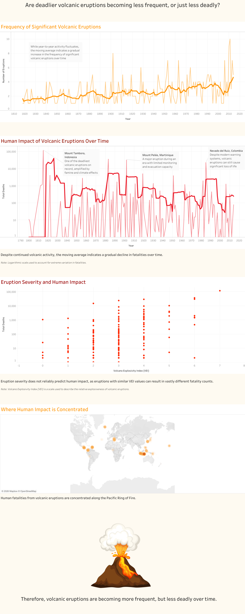

# Volcanic Eruption Trends & Geographic Distribution (Tableau)

An interactive Tableau dashboard analysing global volcanic eruption frequency, severity, and geographic distribution over time.

## Dashboard Preview

  

## Live Dashboard

[https://public.tableau.com/your-link](https://public.tableau.com/views/VolcanicEruptionsandHumanImpactseconditeration/VolcanicEruptionsandHumanImpactFrequencySeverityandSpatialConcentration?:language=en-GB&:sid=&:redirect=auth&:display_count=n&:origin=viz_share_link)

## Project Overview

This project explores global volcanic activity to understand patterns in eruption frequency, geographic concentration, and human impact over time. The dashboard highlights long-term trends in volcanic behaviour and provides context for how monitoring, evacuation systems, and disaster preparedness have influenced fatality outcomes.

## Tools & Technologies

- Tableau
- Calculated Fields
- Time Series Analysis
- Geospatial Analysis
- Data Visualisation
- Insight Generation
- Data Storytelling

## Key Features

- Moving averages to highlight long-term eruption trends
- Logarithmic scaling to analyse highly variable fatality counts
- Time-series analysis of volcanic eruption frequency
- Geographic mapping of eruption density and global distribution
- Interactive tooltips and filtering for deeper exploration

## Key Insights

- Eruption frequency appears to increase over time, possibly due to improved monitoring and reporting systems
- Fatalities from volcanic eruptions have generally declined despite continued volcanic activity
- Certain geographic regions experience significantly higher eruption concentration, particularly along the Pacific Ring of Fire

## Dataset

Significant Volcanic Eruptions Dataset  
(Source: Tableau dataset)

## Author

Sneha Besu  
Computer Science Graduate from UNSW
